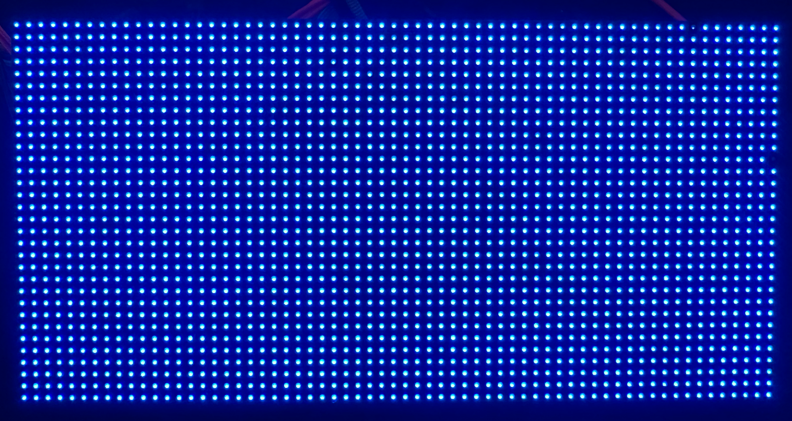
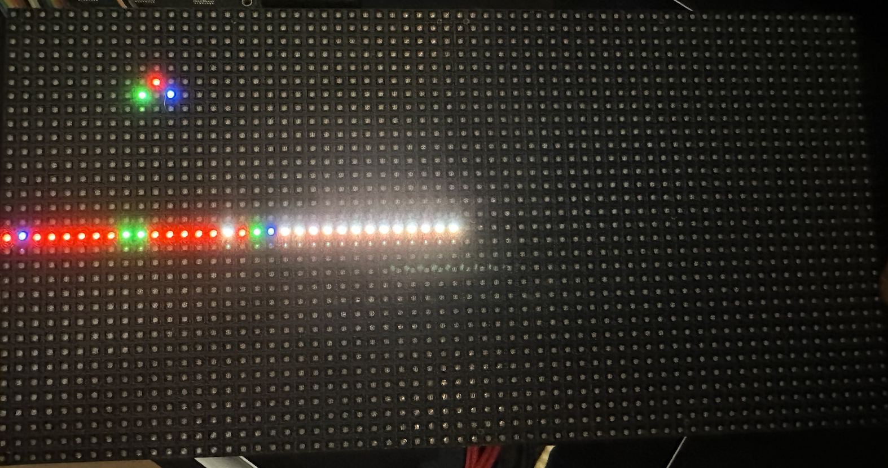
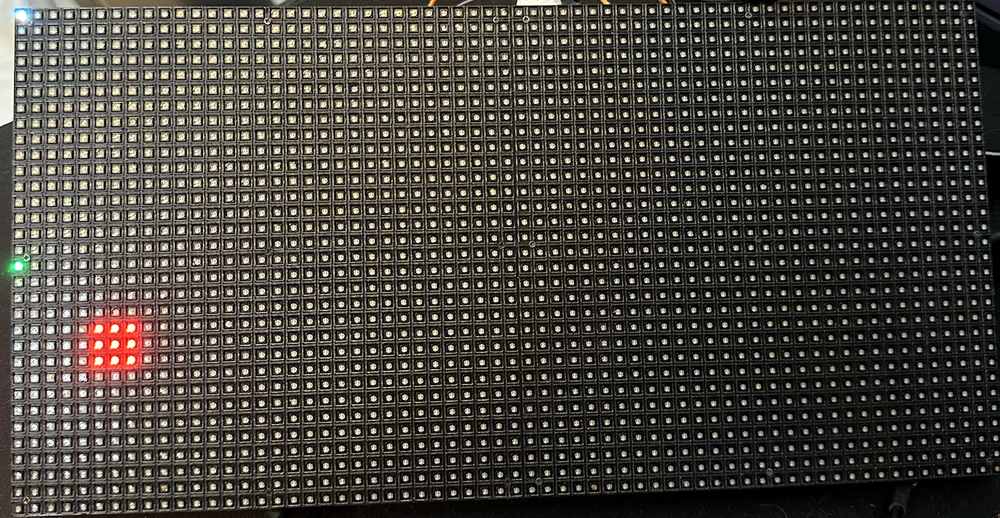

## RGB LED Matrix

The individually addressable RGB LED Matrix board uses HUB75 style pinout, for example: [Adafruit RGB LED matrix](https://www.adafruit.com/product/2279). It comes in many size: 64(col)x32(row), 32x32, 32x16, etc with various size pitch (2mm - 6mm commonly). Please do not use any power supply higher than 5V for this. It can handle power supply rated for more amps, e.g: 10A but never use one with higher voltage.

> Note that this driver is meant for 2/N scan rate only, where N is the number of rows.

[If you're using these Adafruit matrices, be sure to read the operating guide first. ](https://learn.adafruit.com/32x16-32x32-rgb-led-matrix/powering)

This driver is written in [Lucid V2](https://alchitry.com/tutorials/lucid-reference/) and is meant to be run on [Alchitry Au](https://www.sparkfun.com/products/16527) Boards + [Alchitry Br](https://www.sparkfun.com/products/16524) prototype element board.

### Scan rate

**This driver is meant for matrices with scan rate of 2/N where N is number of rows**. Hence, for 64x32: 1/16 scan rate, 32x16: 1/8 scan rate and so on. It will NOT work for 32x16 1/4 scan rate. You should checkout the other branch for that.

## Demo

Connect all relevant pins to the following Br pins. They can be found under constraint `custom.acf`.

```
// to LED matrix
pin red0 C49;
pin red1 C48;
pin green0 C46;
pin green1 C45;
pin blue0 C43;
pin blue1 C42;

pin latch C2;
pin blank C5;
pin sclk_out C8;

pin address[0] C3;
pin address[1] C6;
pin address[2] C9;
pin address[3] C12;
```

Here, `address[0]` will correspond to `A`, `address[1]` corresponds to `B`, and so on.

If you use ribbon connector, make sure to swap the columns:


## Usage

By default, we are using a 32 by 64 rgb led matrix.

You can customise the parameter `ADDRESS_SIZE` (log2 of number of rows) and `MATRIX_WIDTH` (number of columns) when instantiating `matrix_writer.luc`.

It receives 6 bits input data, and outputs all necessary signals to the LED matrix.

```
    input data[6], // input data from a simple RAM [b1,g1,r1,b0,g0,r0], see sample data below
    ...

    // output to matrix
    output red0,
    output green0,
    output blue0,
    output red1,
    output green1,
    output blue1,
    output latch,
    output blank, // also known as OE
    output sclk_out,
    output address[ADDRESS_SIZE], //row address current write to LED matrix
```

If you're using a RAM to drive the `matrix_writer`, you may use its output: `row_index` and `col_index` to address the RAM, and the RAM's output should feed in to `data[6]` port of `matrix_writer.luc`.

## Modes

There are two modes in the demo, manual and ram mode. It depends on `io_dip[2][1:0]`:

1. 0: static mode, all LED to blue color
2. 1: ram triangle mode, you can dynamically set the colors of the LEDs in a triangular fashion (custom, please don't copy)
3. 2: ram player mode, you can move a player block using `io_button[3:0]`

### Manual mode

When compiled and loaded, you should see that all pixels are set to **blue** color.



### RAM Triangle mode

This mode is created to demonstrate how we can write to a RAM and continuously read it to render the output at the matrix.

In this mode, you should see the following before pressing anything:


The matrix is divided into two parts: top half (triangle), and bottom half (flattened triangle). This is to follow how exactly this matrix is driven: top half and bottom half in parallel, one row from each halves at a time.

We created `matrix_ram.luc` that follows this construct. **You can reuse this module to your own use**. Here we created top half and bottom half ram (dual port) and store data there. The `matrix_ram` is then connected to the `driver` so that the driver can obtain the data based on row and col index:

```
// ram_mode.luc

        matrixram.row_address = driver.row_index
        matrixram.col_address = driver.col_index

        // connect matrixram with matrixwriter to push the pixel values out to the matrix
        driver.data = c{matrixram.bottom_out, matrixram.top_out}
```

The module `ram_writer` populates the `matrix_ram`. This is our custom module created for the sole purpose of this demonstration, it created a triangle in the top half and a flattened triangle content in the bottom half. Do not reuse this module, chances are that it does not suit your use case.

#### The Triangle

There are 15 dots on the triangle, we name them dot 0 to dot 14. The topmost red dot is dot 0, then the blue is dot 1, and so on, left to right. The bottom rightmost dot is dot 14. They are actually mapped to the address of the matrix inside `ram_writer.luc`,

```
    const ADDRESS_MAPPING = {
        {6d0, 6d0}, //unused
        {6d9, 6d14},
        {6d9, 6d12},
        {6d9, 6d10},
        {6d9, 6d8},
        {6d9, 6d6},
        {6d8, 6d13},
        {6d8, 6d11},
        {6d8, 6d9},
        {6d8, 6d7},
        {6d7, 6d12},
        {6d7, 6d10},
        {6d7, 6d8},
        {6d6, 6d11},
        {6d6, 6d9}, // row 6 col 9
        {6d5, 6d10} // row 5, col 10
    }
```

At row 5 and col 10, we have the position of our dot 0, dot 1 is at position row 6 col 9 and so on.

The idea is to switch ON or OFF each dot in these 15 positions, and to color it red, blue, or green.

#### Triangle dot position

You can use `io_dip[1:0]` to set your own triangle, and `io_button[3:0]`. Follow this steps:

1. Set `io_dip[0]` to `0000 0001` then press `io_button[2]` to confirm (nothing will show though, so just be sure you pressed it). This sets the color of the red dot.
2. Set `io_dip[0]` to `0000 0010` then press `io_button[1]` to confirm. This sets the color of the green dot.
3. Finally, set `io_dip[0]` to `0000 0100` then press `io_button[3]` to confirm . This sets the color of the blue dot.

Meanwhile, set all `io_dip[1]` switches to be OFF.

Then press `io_button[0]` to update the display. You should see your triangle changed, and the flattened triangle data shown in the bottom half. White pixels indicate unset dots in the triangle.



The "on" or "off" on each of the 15 triangle position is 1-hot encoded using `io_dip[1:0]`. Initially we set the following for red: `0000 0000 0000 0001`, that means red pixel is only drawn on dot 0 position. The same logic for green, and blue.

If you set them to turn on at the same location, it will take this precedence: blue > green > red.

Therefore, setting red as: `0000 0000 0000 1111`, and green as `0000 0000 0000 0011` and blue as `0000 0000 0000 1010` will result in a green dot at position 0, blue dot at position 1 and 3, and red dot at position 2.

The bottom half will show all the flattened past triangles you have created.

### Ram Player Mode

When compiled and loaded, you should see a 3x3 player sprite in red:



You can move the player using the following io buttons:

1. up: `io_button[0]`
1. down: `io_button[2]`
1. left: `io_button[3]`
1. right: `io_button[1]`

Note that `io_button[4]` can't be used because we are using its port for the output signal on C bank.

The player is clamped to not go off-screen in a 32x64 matrix.
